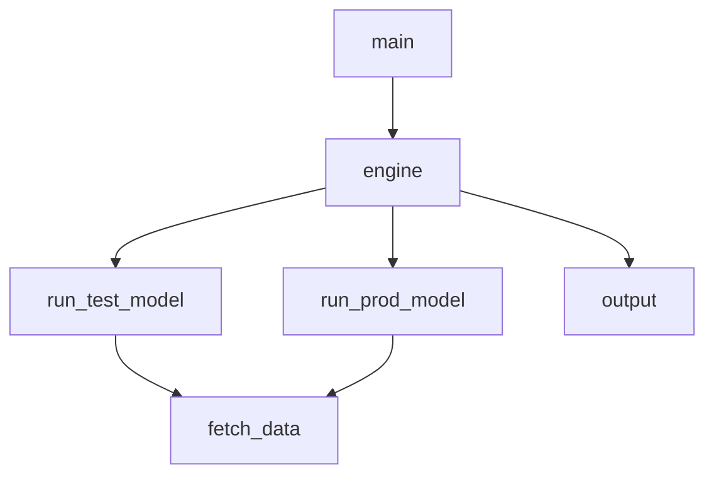

# inpatients_forecasting
### Description:
We are forecasting the daily number of hospital inpatients **_y_** of hospitals **[hospital_1, hospital_2]** for **_h_** days into the future (_prediction horizon_).
To implement the forecasting we use the $\color{blue}prophet$ algorithm.

### Input files:
The code loads (_n_) .xlsx files, each one containing data for each hospital. Each .xlsx file includes the columns:
  **ds := _date_** and **y := _number of inpatients_**. 
In this implementation _n = 2_.

### User input parameters:
Here are the user input parameters that are determined in module _main.py_ :
- RUN_MODE : determines if the mode of the code ( values _'prod'_, _'test'_ or _'hybrid'_ )
- HOSPITAL_list : list holding the hospital IDs of the hospitals whose inpatients the code forecasts ( values : _1_, _2_ )
- HORIZON_VALUE : determines the # of days for which the code forecasts the inpatients, namely the _prediction horizon_ ( in our example value is _14_ )
- CAP_TYPE : determines the type of cap used in the code for the maximum number of inpatients allowed by the algorithm ( values : 'soft', 'hard' )

### Required python packages:
The required packages are included in file _requirements.txt_.

### Code diagram:
Below is the code diagram displaying the relationships between its modules:

