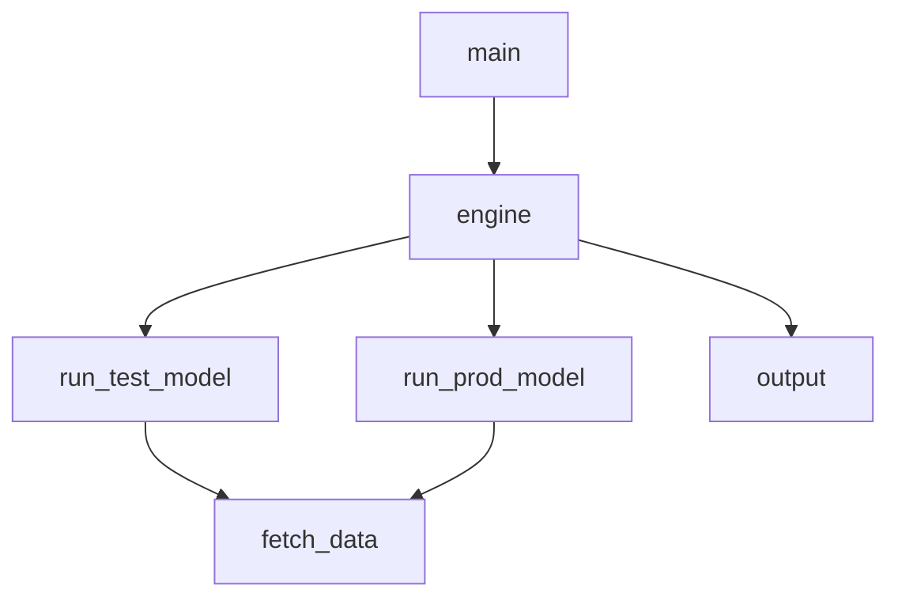

# inpatients_forecasting
We are forecasting the number of hospital inpatients **_y_** for a given prediction horizon **_h_** for hospitals **(hospital_1, hospital_2)**.

The $\color{blue}prophet$ algorithm is implemented on a dataset containing the columns **ds := _date_** and **y := _number of inpatients_**.

The code loads (_n_) .xlsx files, each one containing data for each hospital. In this implementation _n = 2_.

Here are the user input parameters :
- RUN_MODE : determines if the mode of the code ( values _'prod'_, _'test'_ or _'hybrid'_ )
- HOSPITAL_list : a list of the hospital IDs of the hospitals whose inpatients the code forecasts ( values : _1_, _2_ )
- HORIZON_VALUE : determines the # of days for which the code forecasts the inpatients, namely the _prediction horizon_ ( in our example value is _14_ )
- CAP_TYPE : determines the type of cap used in the code for the maximum number of inpatients allowed by the algorithm ( values : 'soft', 'hard' )

The required packages are included in file _requirements.txt_.

Below is the code diagram displaying the connection of the python modules:

