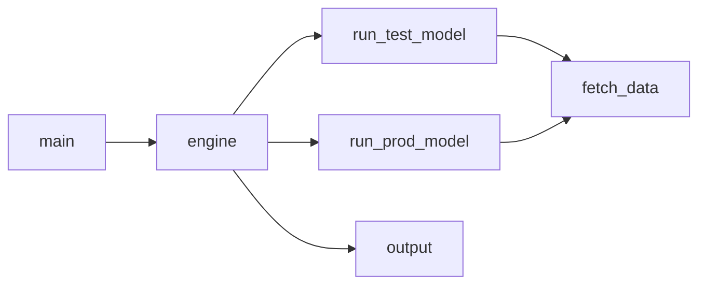

# inpatients_forecasting
### Overview:
We are forecasting the daily number of hospital inpatients **_y_** of hospitals **[hospital_1, hospital_2]** for **_h_** days into the future (_forecast horizon=h_).
The code may be modified to process data of any number of hospitals (_see 'input parameters' below_).<br>
The code is written in Python and the forecasting is implemented by using the [prophet](https://github.com/facebook/prophet/releases) algorithm.

### Input files:
The code loads (_n_) ```.xlsx``` files, each one containing data for each hospital. <br>
Each ```.xlsx``` file includes columns **ds := _date_** and **y := _number of daily inpatients_**.<br>
For this implementation _n = 2_.

### Input parameters:
Here are the input parameters that are determined in module ```main.py```:
- RUN_MODE : determines the mode of the code and takes the following values:
    - _'prod'_ : invokes module ```run_prod_model.py```
    - _'test'_ : invokes module ```run_test_model.py```
    - _'hybrid'_ : invokes module ```run_test_model.py``` and then module ```run_prod_model.py```
- HOSPITAL_list : list holding the hospital IDs of the hospitals whose data the code processes ( values : _1_, _2_ )
- HORIZON_VALUE : determines the _forecast horizon_, namely the number of days for which the code forecasts the number of inpatients <br>
( for our implementation we choose value HORIZON_VALUE = _14_ )
- CAP_TYPE : determines the type of cap used in the code for the maximum number of inpatients allowed by the algorithm ( values : _'soft'_, _'hard'_ )

### Dependencies:
The required packages are included in file ```requirements.txt```.<br>
Python interpreter version used for this project: **3.9.4**

### Code structure:
Following are descriptions of the python modules used in the code:

- ```main.py```: defines the input parameters described above and then invokes module ```engine.py```
- ```engine.py```: controls the code flow, depending on the selected values of the input parameters
- ```run_test_model.py```: runs prophet in test mode
- ```run_prod_model.py```: runs prophet in production mode
- ```fetch_data.py```: reads the input ```.xlsx``` files of each hospital
- ```output.py```: stores results in relative folder path ```'./data_pool/'```

Below is the code diagram displaying the relationships between its modules:

